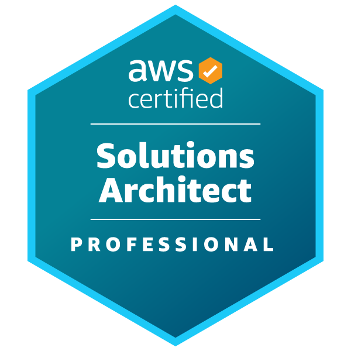
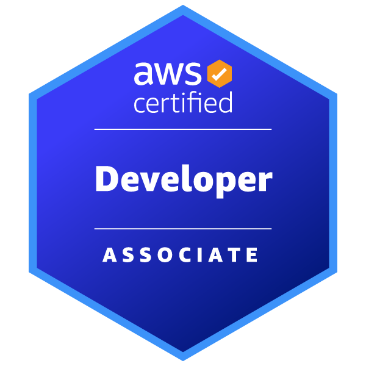
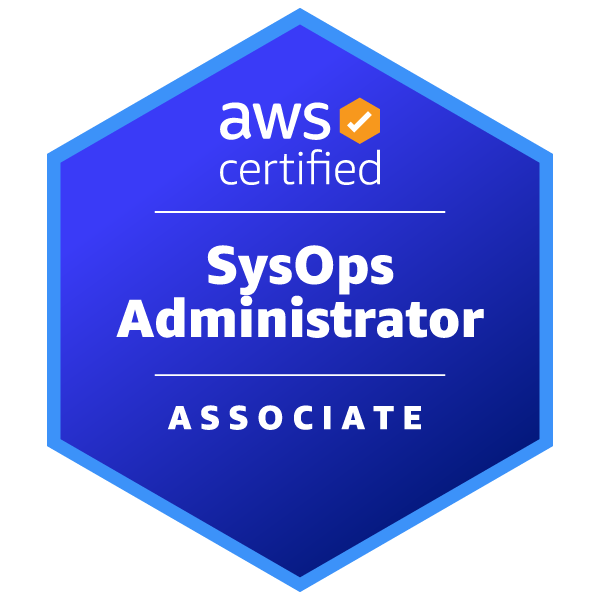
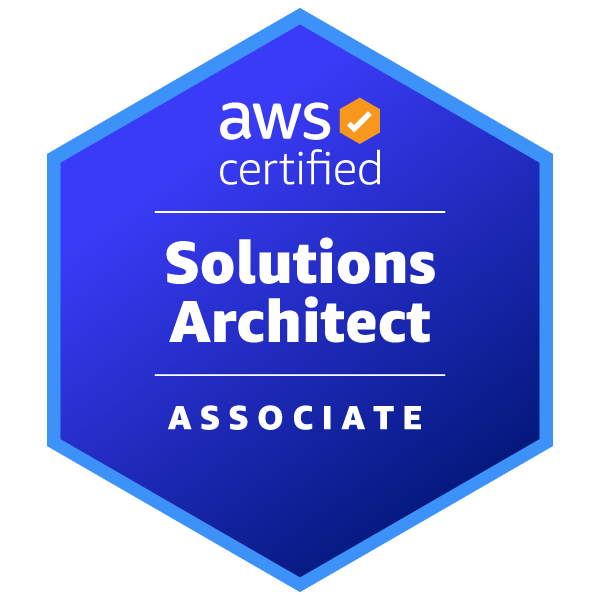
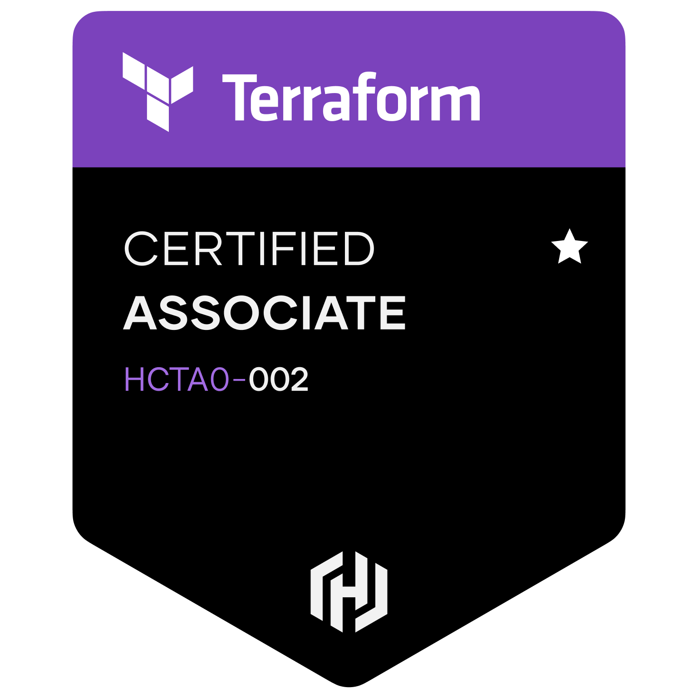
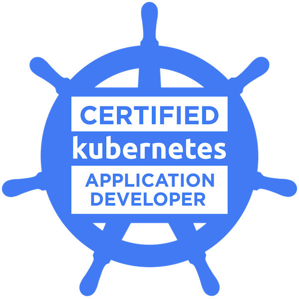
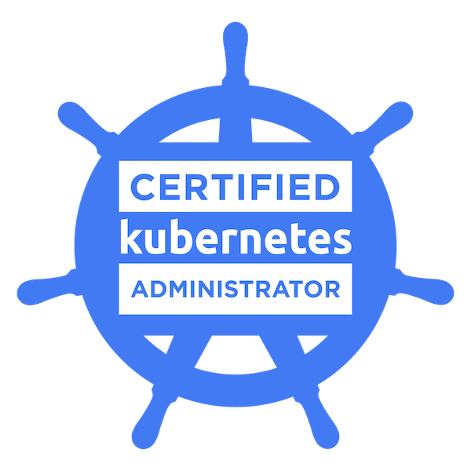

# 👋 Hi, I’m Daniel!

## 
- ☁️ I'm currently a cloud engineer specializing in containers
- 🔭 I've been building infrastructure solutions on AWS
- 🌱 I’m currently learning development using Python and running workloads on Kubernetes
- 📫 You can reach me on [LinkedIn](https://www.linkedin.com/in/danieltle/)

### Badges I've been collecting

